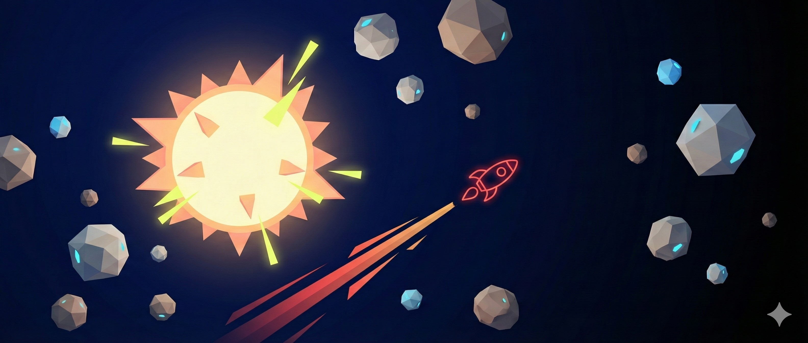
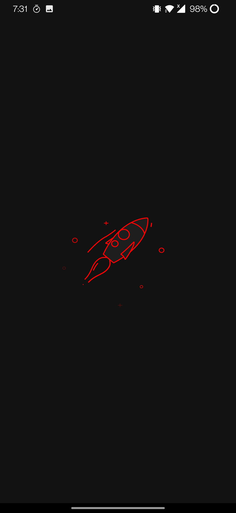
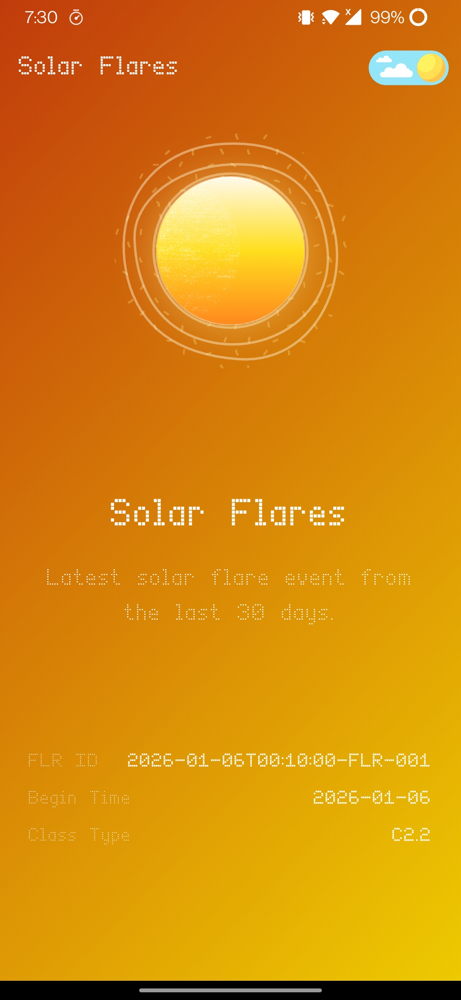

# Astro 🌌



**Astro** is an immersive Flutter application that brings the cosmos to your fingertips. By integrating with NASA's Open APIs, Astro provides real-time visualizations and data regarding Near-Earth Objects (Asteroids), Geomagnetic Storms, and Solar Flares.

The app features a fluid, gesture-driven interface designed to make exploring complex astronomical data intuitive and engaging.

<!-- Screenshots Gallery -->
<p align="center">
  
  
</p>


<p align="center">
  <b>Explore the Universe with Fluid Animations and Real-time Data</b>
</p>

---

## 📸 Features

* **Asteroid Watch**: Track near-earth objects detected within the last 7 days. View statistics on potentially hazardous asteroids and recent close approaches.

* **Space Weather Monitoring**:
  * **Geomagnetic Storms (GST)**: Monitor planetary K-index data to track magnetic disturbances affecting Earth.
  * **Solar Flares (FLR)**: View recent solar flare classifications, peak times, and active region data.

* **Immersive UI**:
  * **Liquid Swipe Navigation**: Seamlessly transition between cosmic events with fluid gestures.
  * **Lottie Animations**: High-quality animations for loading states, weather events, and planetary backgrounds.
  * **Dynamic Theming**: Fully supported Dark and Light modes with persistent state.

* **Offline Capability**: Smart caching mechanism allows users to view previously fetched data even without an internet connection.

* **Network Intelligence**: Real-time network monitoring with auto-reconnection handling.

## 🛠 Tech Stack

* **Framework**: [Flutter](https://flutter.dev/) (Dart)
* **State Management**: [GetX](https://pub.dev/packages/get)
* **Networking**: `http`
* **UI Components**:
  * `liquid_swipe`: For the core navigation experience.
  * `lottie`: For vector animations.
  * `fluttertoast`: For non-intrusive user alerts.
  * `flutter_animate`: For UI transition effects.
* **Local Storage**: `shared_preferences` (for caching and theme persistence).
* **Architecture**: MVVM with Repository Pattern.

## 🚀 APIs Used

This project utilizes the NASA Open APIs:

**NeoWs (Near Earth Object Web Service):**  
https://api.nasa.gov/neo/rest/v1/feed

**DONKI (Space Weather Database Of Notifications, Knowledge, Information):**

GST:  
https://api.nasa.gov/DONKI/GST

FLR:  
https://api.nasa.gov/DONKI/FLR

---

## ⚙️ Installation & Setup

Follow these steps to run the project locally.

### Prerequisites

- Flutter SDK (>=3.24.0)  
- Dart SDK (>=3.5.0)  
- An IDE (VS Code or Android Studio)

### Steps

Clone the repository

```bash
git clone https://github.com/KrispNut/Astro.git
cd Astro
```
Install dependencies

```bash
flutter pub get
```
## API Key Configuration

The project currently uses a hardcoded demo key in `lib/core/utils/constants.dart`.

For production or extended development, obtain your own API key from api.nasa.gov and replace the value in `Constants.token`.

---
## Run the App

```bash
flutter run
```
## 🤝 Contributing

Contributions are welcome! If you have suggestions for improvements or bug fixes, feel free to fork the repository and submit a pull request.
